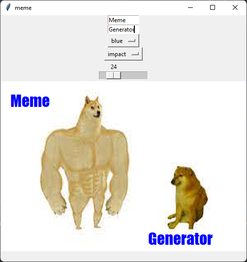

# Python Gui Meme Generator

## Description:

This project is a simple guide to getting started on creating a GUI application on Python. This project makes use of the [guizero python library](https://lawsie.github.io/guizero/about/).

## How to Run:

1. Fork the Repository
2. Clone the Repository
3. Run the Code in your IDE

## Source Code:

```python
# Imports -------------------------------
from guizero import App, TextBox, Drawing, Combo, Slider

# Functions -----------------------------
def draw_meme():
    meme.clear()
    meme.image(0, 0, "./images/Shiba_Dog.png", width=500, height=345)
    meme.text(20, 20, top_text.value, color=color.value, size=size.value, font=font.value)
    meme.text(300, 300, bottom_text.value, color=color.value, size=size.value, font=font.value)

# App -----------------------------
app = App("meme")

top_text = TextBox(app, "top text", command=draw_meme)
bottom_text = TextBox(app, "bottom text", command=draw_meme)

color = Combo(app,
      options=["black", "white", "red", "blue", "green", "purple", "orange"],
      command=draw_meme,
      selected="black")
font = Combo(app,
      options=["times new roman", "verdana", "courier", "impact"],
      command=draw_meme,
      selected="times new roman")
size = Slider(app, start=20, end=40, command=draw_meme)

meme = Drawing(app, width="fill", height="fill")

draw_meme()

app.display()
```

## GUI Result:



## Online Resources:
* [Guizero](https://lawsie.github.io/guizero/about/)
* [Guizero - Drawing](https://lawsie.github.io/guizero/drawing/)
* [Guizero - TextBox](https://lawsie.github.io/guizero/textbox/)
* [Guizero - Combo](https://lawsie.github.io/guizero/combo/)
* [Guizero - Slider](https://lawsie.github.io/guizero/slider/)
